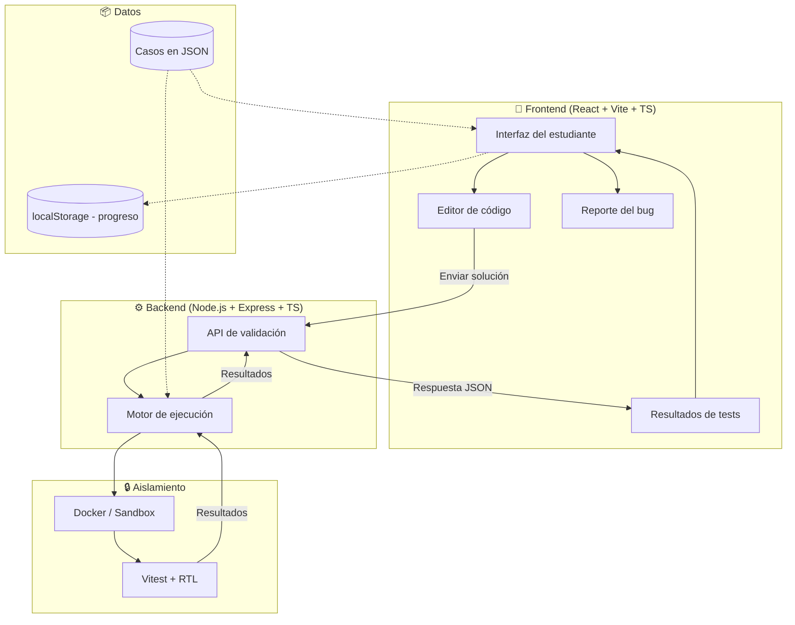
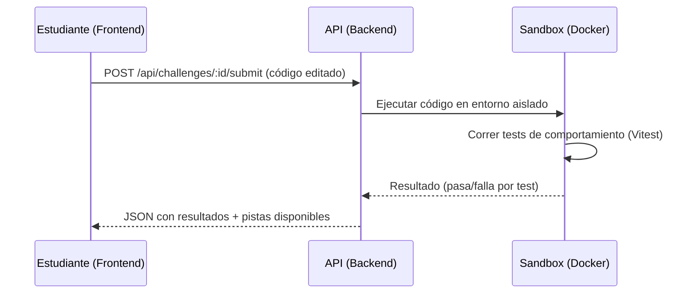

# Arquitectura — BugLab

## 1. Visión general

BugLab es una aplicación web con arquitectura frontend/backend desacoplada. El frontend gestiona la experiencia del estudiante (lectura del caso, edición de código); el backend ejecuta la validación de la solución de forma aislada (sandbox/Docker) y devuelve los resultados de los tests.



## 2. Módulos

| Módulo | Ubicación | Responsabilidad |
|---|---|---|
| UI del caso | `frontend/src` | Mostrar reporte, arquitectura simplificada, árbol de archivos y editor |
| API de validación | `backend/src` | Recibir la solución del estudiante y coordinar la ejecución |
| Casos (challenges) | `backend/challenges/BUG-001..003` | Definición de cada reto: código inicial, tests, pistas, explicación |
| Sandbox | `backend/sandbox`, `backend/docker` | Aislar la ejecución de código enviado por el estudiante |
| Motor de tests | Vitest + React Testing Library | Validar comportamiento observable, no comparación exacta de código |

## 3. Comunicación Frontend ↔ Backend



## 4. Integración con APIs o IA

No aplica en este MVP — no hay integración con APIs externas ni modelos de IA. Toda la lógica de validación es local, mediante tests de comportamiento predefinidos por caso.

## 5. Esquema de datos de un caso (JSON)

```json
{
  "id": "BUG-001",
  "difficulty": "easy",
  "report": "Un usuario de exactamente 18 años no puede registrarse.",
  "architecture": "RegisterPage → RegisterForm → validation.js",
  "files": ["validation.js"],
  "hints": ["Revisa la condición de edad mínima"],
  "explanation": "La condición usaba > en vez de >=, excluyendo el valor límite."
}
```